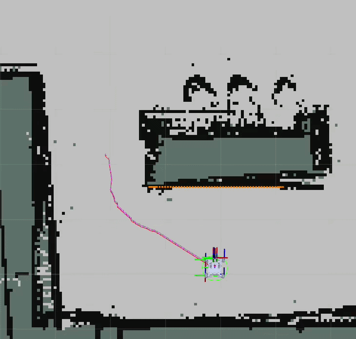
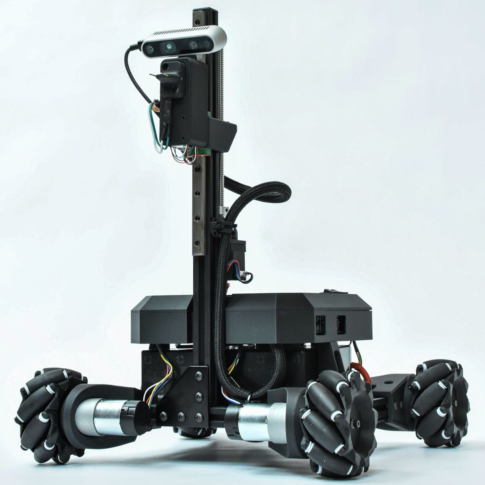
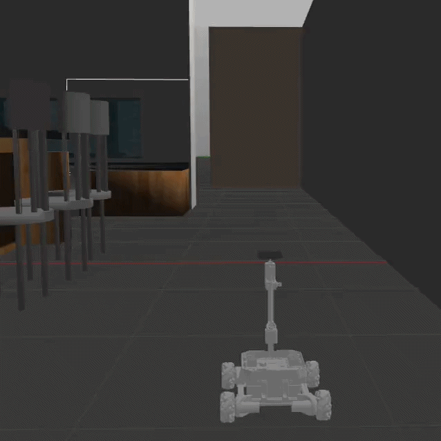

# Visual SLAM and Autonomous Navigation for a Custom Robot | [GitHub](https://github.com/vaibhavparekh9/Mechatronics/)

---

## Background

An end-to-end autonomy stack for a custom 4-wheeled mecanum-drive robot. The robot uses a RealSense D435 depth camera as its only exteroceptive sensor for mapping and localization.

This project serves as a basic framework for visual SLAM and navigation, and can be set up on any custom robot platform. Feel free to clone the repo from my [GitHub Repo](https://github.com/vaibhavparekh9/Mechatronics/), and edit it according to your robot!

---

## Tools

**Software:** ROS 2 Humble, Gazebo, RTAB-Map, Nav2, RViz  
**Hardware:** Custom mecanum-drive robot (SolidWorks CAD), Intel RealSense D435  

  

<em>Fig. RViz (left); Physical Robot Prototype (center); Gazebo Simulation (right)</em>

## Robot Description

The robot was designed in SolidWorks and exported as a URDF using the SolidWorks-to-URDF exporter. The exported model was converted to Xacro to integrate the RealSense D435 camera macro, giving accurate sensor geometry and optical frames.

In Gazebo simulation, the mecanum base is driven via a planar-move plugin that accepts standard `Twist` commands, providing holonomic motion (forward, strafe, rotate) without low-level wheel simulation.

---

## SLAM

RTAB-Map provides RGB-D visual SLAM with loop closure detection and occupancy grid generation. It runs two nodes:

- **Visual odometry** (`rgbd_odometry`): estimates pose from RGB + depth frames.
- **SLAM** (`rtabmap`): builds a map, detects loop closures, and publishes a 2D occupancy grid and 3D point cloud.

The generated map is exported as a `.pgm` + `.yaml` pair for Nav2.

---

## Autonomous Navigation

Nav2 plans and executes paths on the saved map. Key design choices:

- **No AMCL.** RTAB-Map runs in localization mode, loading its database and publishing the `map → odom` transform directly, replacing laser-based localization entirely.
- **Depth-only obstacle avoidance.** The D435 depth stream is converted to point clouds and segmented into ground/obstacle layers, which feed Nav2's local costmap.
- **Holonomic controller.** The DWB local planner outputs full holonomic twists, matching the mecanum drive.

Because the D435 is forward-facing only, the navigation parameters are tuned conservatively: lower speeds, inflated local costmap, and unknown-space tracking to prevent the robot from driving into unobserved areas.

---

For full setup instructions, architecture details, and troubleshooting, see the [project README on GitHub](https://github.com/vaibhavparekh9/Mechatronics/).
