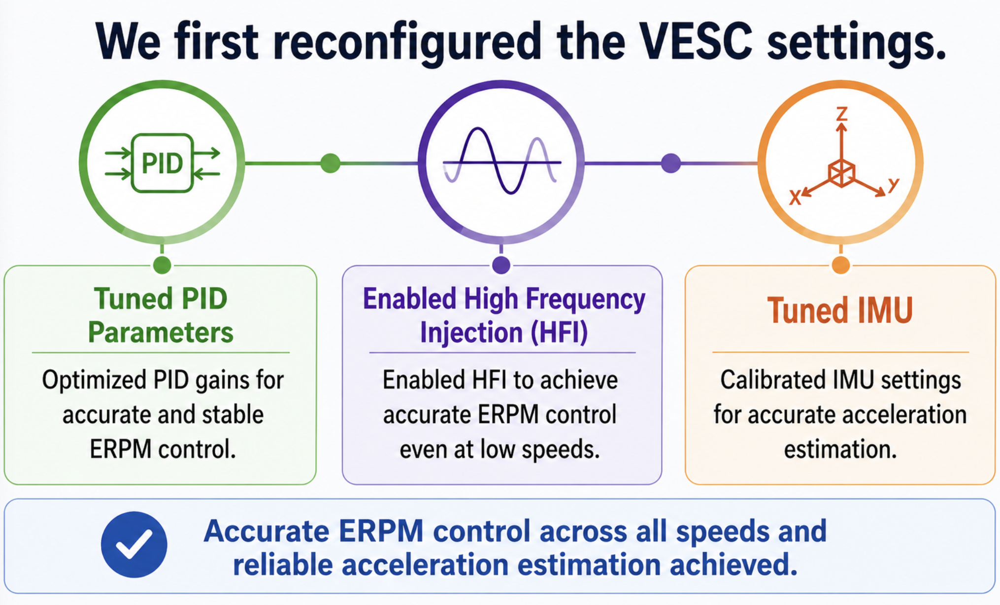
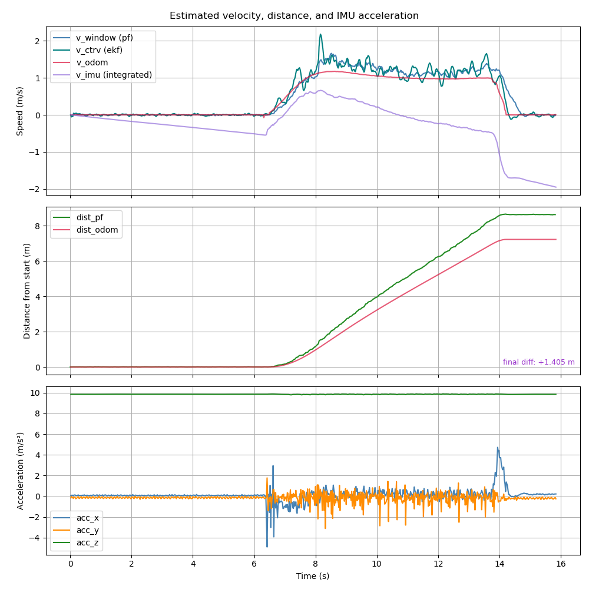
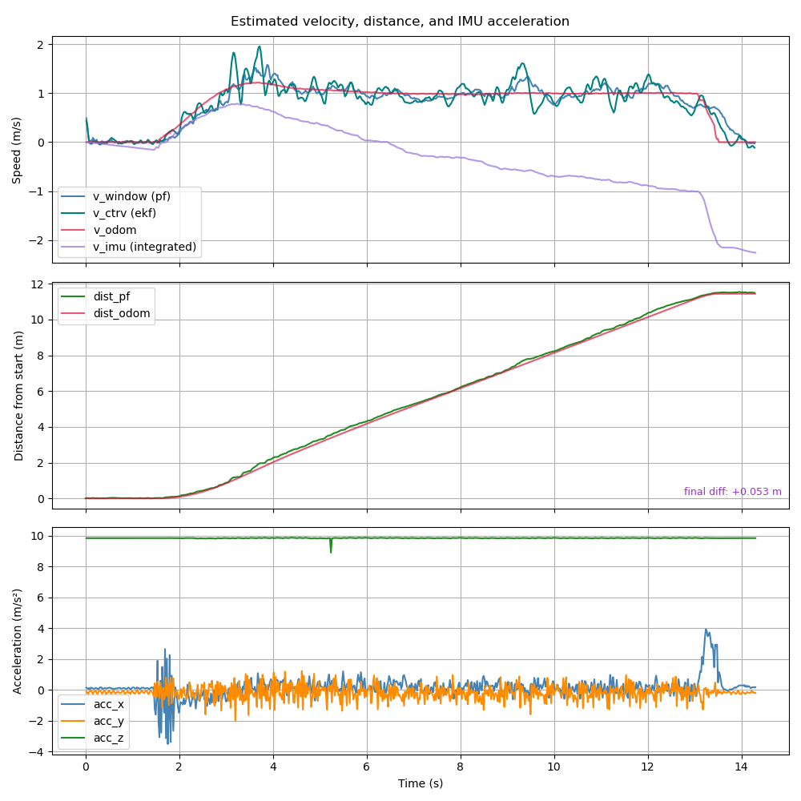
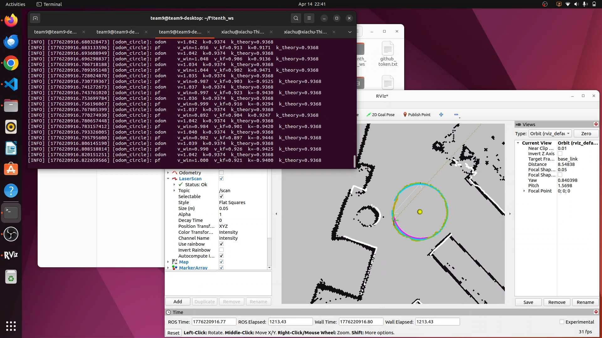

# FOCASS: F1TENTH Odometry-Calibrated Anti-Skid System | [Report](report.pdf) | [GitHub](https://github.com/vaibhavparekh9/f1tenth_ws)

**Association:** Carnegie Mellon University  
**Course:** 16-663: F1-Tenth Autonomous Racing

---

## Abstract

FOCASS addresses two practical limitations in sim-to-real F1TENTH autonomous racing: inaccurate steering and speed control due to imperfect odometry/VESC tuning, and traction loss on low-friction surfaces.

The system couples a visual odometry/VESC tuner with online slip detection and velocity-profile adaptation. We implemented both raceline-deviation and velocity-mismatch slip detectors, and reduced local waypoint speed limits after slip events so subsequent laps remain within the vehicle's traction limits.

**Contributions:** Visual odometry/VESC tuner, raceline-deviation slip detection, velocity-mismatch slip detection, online anti-skid system.

---

## Videos

<figure>

<video src="images/odom-tuner.mp4" autoplay controls loop muted playsinline preload="metadata" style="max-width:800px;width:100%;border-radius:5px"></video>

<figcaption>Odometry/VESC tuner: visual comparison between measured trajectory and predicted trajectory for odometry/VESC tuning. Green: measured trajectory. Blue: fitted trajectory. Pink: predicted trajectory.</figcaption>
</figure>

<figure>

<video src="images/raceline-deviation.mp4" autoplay controls loop muted playsinline preload="metadata" style="max-width:800px;width:100%;border-radius:5px"></video>

<figcaption>Raceline-based anti-skid system: the anti-skid system detects off-raceline slip and reduces speed near affected waypoints.</figcaption>
</figure>

<figure>

<video src="images/speed-anti-skid.mp4" autoplay controls loop muted playsinline preload="metadata" style="max-width:800px;width:100%;border-radius:5px"></video>

<figcaption>Speed-based anti-skid system: the anti-skid system detects velocity mismatch between wheel encoder and IMU and reduces speed near affected waypoints.</figcaption>
</figure>

---

## Method

### Hardware Configuration

Hardware configuration performed before odometry tuning and slip detection experiments.

---

### 01 — Visual Odometry/VESC Tuner

The odometry tuner visualizes and compares the actual trajectory of the vehicle with the theoretical trajectory predicted from the commanded motion, then uses the discrepancy to suggest VESC calibration updates.

---

### 02 — Raceline-Deviation Slip Detection

The first detector compares the car's localized position with the planned raceline and records a slip event when the distance to the nearest waypoint exceeds a threshold.

---

### 03 — Velocity-Mismatch Slip Detection

The second detector compares wheel-encoder velocity with IMU-integrated velocity over a short time window. A large mismatch indicates wheel slip.

---

### 04 — Online Anti-Skid System

When wheel slip is detected, the controller maps the event to the nearest waypoint and reduces speed limits within a local radius. The reduction scales with the velocity error and persists across laps, iteratively adapting the race line to the available traction.

---

## Results

<figure style="flex:1;min-width:0">

<figcaption>Before tuning: odometry estimate with 1.405 m error.</figcaption>
</figure>
<figure style="flex:1;min-width:0">

<figcaption>After tuning: odometry estimate with 0.053 m error.</figcaption>
</figure>

After tuning: theoretical curvature 0.9368, measured curvature 0.94.

---

## Takeaway

FOCASS integrates odometry/VESC tuning and traction handling with existing F1TENTH infrastructure. Better odometry makes the base controller more reliable, and the anti-skid system lets the car adapt its velocity profile after observing where real track conditions exceed the modeled friction limit.
