# PointNet: 3D Point Cloud Classification & Segmentation

This project implements PointNet architectures for two tasks, object classification and per-point part segmentation of 3D point clouds. It includes a robustness study to find out where the deep networks break.

**Association:** Carnegie Mellon University  
**Course:** 16-825: Learning for 3D Vision
**Tools:** PyTorch, PyTorch3D
---

## What I built

- **Classification network** — shared per-point MLPs lifting each `(x, y, z)` into a 1024-D feature space, followed by a symmetric max-pool that collapses N points into a single permutation-invariant global descriptor, then an MLP head over 3 object classes.
- **Segmentation network** — the same point-wise encoder, but the global descriptor is concatenated back onto every individual point feature so each point is classified with both local and whole-object context. Outputs 6 semantic part labels per point.
- **Training pipeline** — data loading, augmentation, checkpointing, and evaluation for both tasks in PyTorch, with PyTorch3D for the rendering of results.

---

## Classification

**Test accuracy: 97.90%** across chairs, vases, and lamps.

<table style="width:100%;max-width:1000px;margin:1rem auto;border-collapse:collapse;text-align:center;">
  <tr>
    <th style="padding:0.5rem;border-bottom:2px solid #2b2b2b;">`chair`</th>
    <th style="padding:0.5rem;border-bottom:2px solid #2b2b2b;">`vase`</th>
    <th style="padding:0.5rem;border-bottom:2px solid #2b2b2b;">`lamp`</th>
  </tr>
  <tr>
    <td style="padding:0.75rem;vertical-align:top;">
      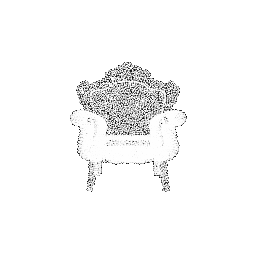 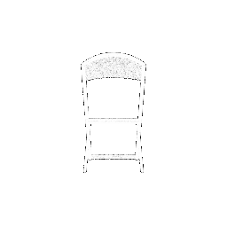 
      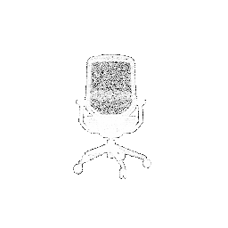 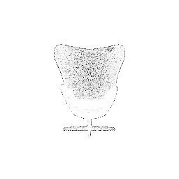
    </td>
    <td style="padding:0.75rem;vertical-align:top;">
      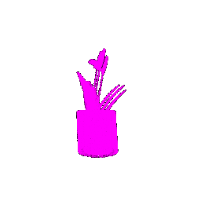 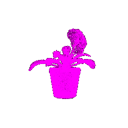 
      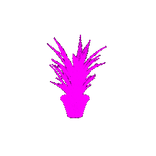 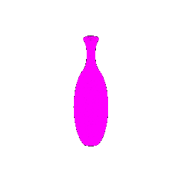
    </td>
    <td style="padding:0.75rem;vertical-align:top;">
      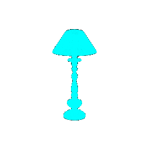 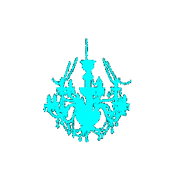 
      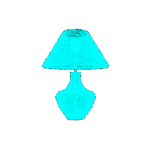 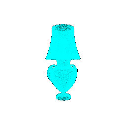
    </td>
  </tr>
</table>

### Failure mode:

Some of the vases are misclassified as lamps (and vice-versa). Chairs are never mistaken.
That asymmetry is a function of what a global max-pool actually learns. The descriptor encodes coarse structural silhouette and not semantics. A chair has four legs, a seat plane, and a back, which is geometrically unlike anything else in the set. A tall vase with a flared rim and a table lamp with a shade might occupy nearly the same shape envelope, confusing the network. 

---

## Part segmentation

**Test accuracy: 90.28%** over 6 semantic parts of chair objects.

<table style="width:100%;max-width:800px;margin:1rem auto;border-collapse:collapse;text-align:center;">
  <tr>
    <th style="padding:0.5rem;border-bottom:2px solid #2b2b2b;">`ground_truth`</th>
    <th style="padding:0.5rem;border-bottom:2px solid #2b2b2b;">`prediction`</th>
    <th style="padding:0.5rem;border-bottom:2px solid #2b2b2b;">Per-object accuracy</th>
  </tr>
  <tr>
    <td style="padding:0.5rem;border-bottom:1px solid #e0e0e0;">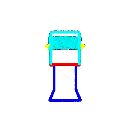</td>
    <td style="padding:0.5rem;border-bottom:1px solid #e0e0e0;">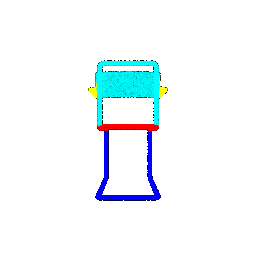</td>
    <td style="padding:0.5rem;border-bottom:1px solid #e0e0e0;"><strong>98.76%</strong></td>
  </tr>
  <tr>
    <td style="padding:0.5rem;border-bottom:1px solid #e0e0e0;">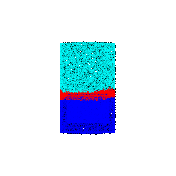</td>
    <td style="padding:0.5rem;border-bottom:1px solid #e0e0e0;">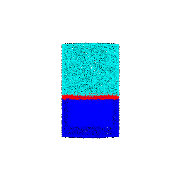</td>
    <td style="padding:0.5rem;border-bottom:1px solid #e0e0e0;"><strong>96.20%</strong></td>
  </tr>
  <tr>
    <td style="padding:0.5rem;">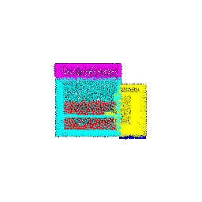</td>
    <td style="padding:0.5rem;">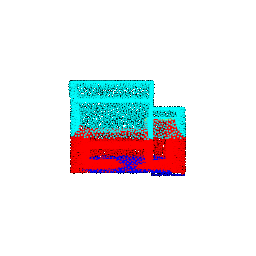</td>
    <td style="padding:0.5rem;"><strong>41.70%</strong></td>
  </tr>
</table>

Interpretation: The segmentation model performs reasonably well and is generally effective at learning the distinction between different features, successfully segmenting them in most cases. However, it struggles when boundaries between regions appear merged or structurally blended, leading to ambiguity in separation and making class differentiation challenging. Example, on the last chair, the armrest merges continuously into the backrest and the seat with no geometric discontinuity to key on.

---

## Robustness analysis

Both experiments use the same trained weights and perturb only the input, which is what a deployed perception stack actually faces.

### 1. Orientation

The test point clouds are rotated about the X-axis at inference time, from 0° to 90°, to analyse the model's classification robustness.

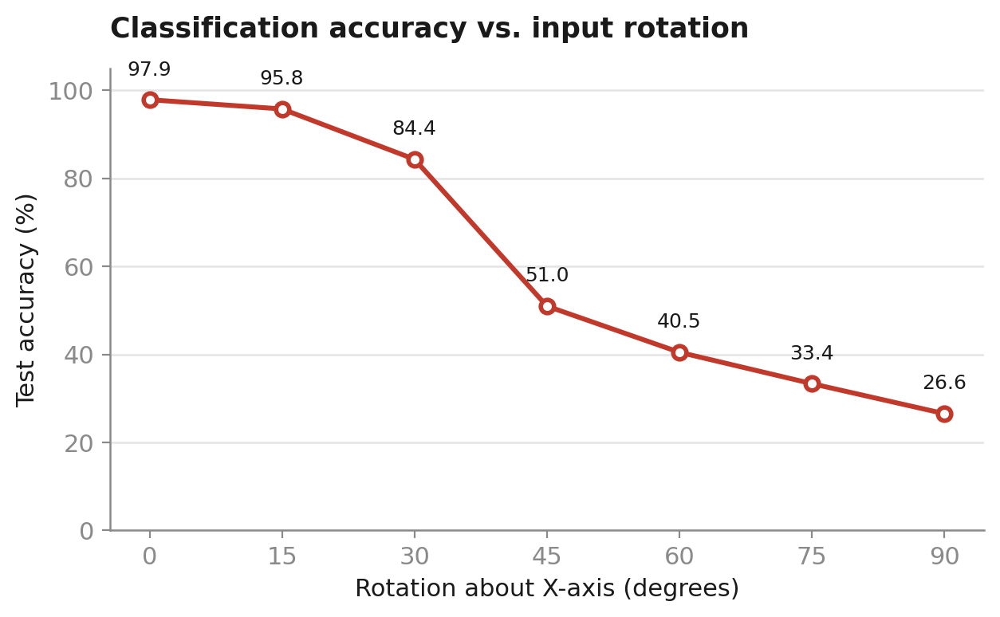

Interpretation: The classification model remains robust to small rotation angles but exhibits a notable decline in performance under larger rotations. This is because rotational invariance is not inherently captured within the current architecture.

### 2. Point density

The number of points sampled per object is reduced from 10,000 to 2,500 for both, classification and segmentation tasks.

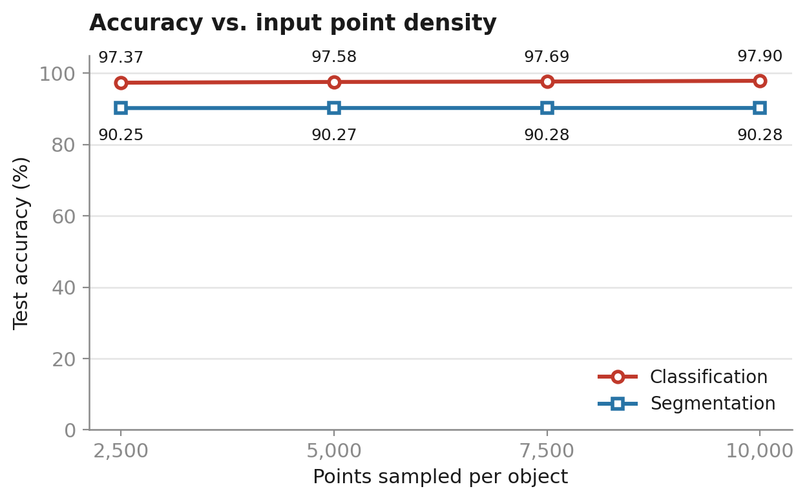

Interpretation: Both classification and segmentation remain feasible with reduced number of points, indicating that the model retains robustness even with reduced input density. This follows directly from the max-pool: the global descriptor is determined by a small set of *critical points* on the shape's extremities, and random subsampling is very unlikely to remove all of them. 
Practically, it means that you can cut the point budget 4× for a 4× speedup without a major loss in accuracy.