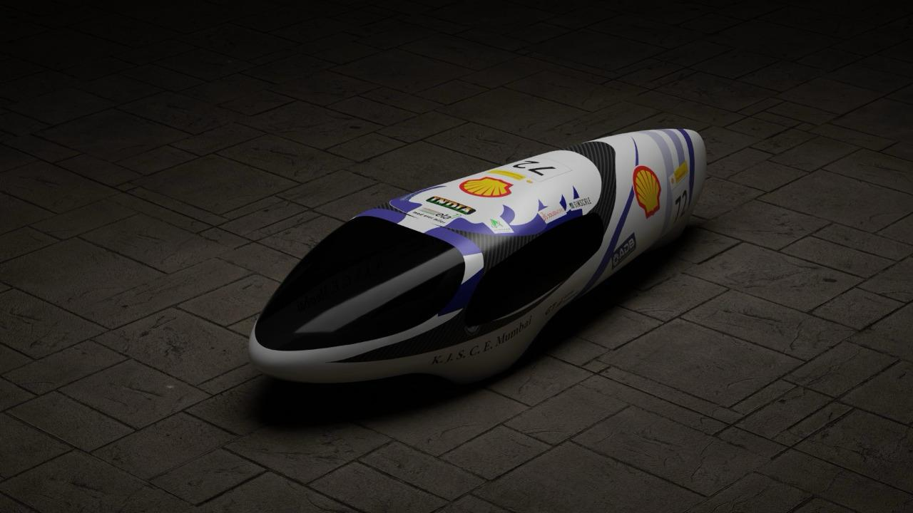
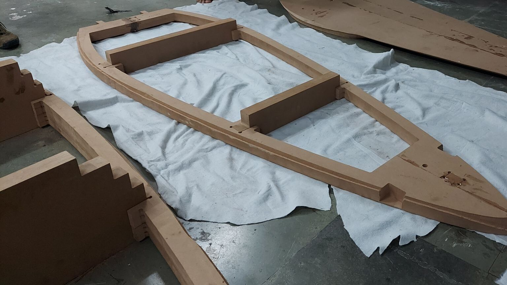
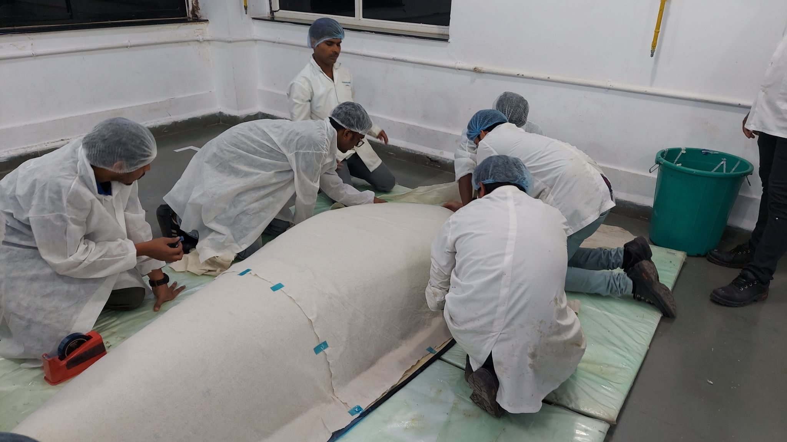
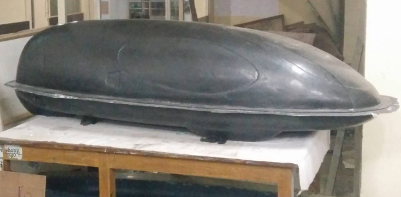
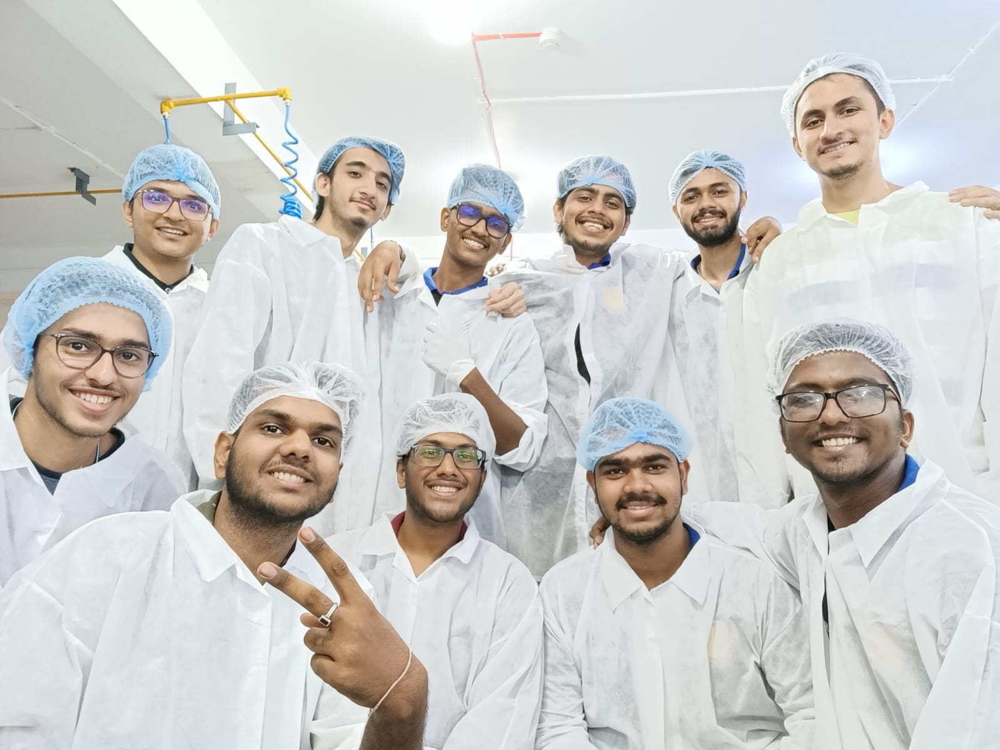

<!-- IMG_RIGHT: images/eta_logo.jpg | 8% -->

# Team Eta: Yugant, A Fuel-Efficient Supermileage Vehicle

**Association:** Team Eta, K. J. Somaiya College of Engineering, Mumbai  
**Role:** Drivetrain Head

<!-- /IMG_RIGHT -->

---

## Background

Team Eta is a student-led SAE Supermileage/Shell Eco-marathon team. These competitions are among the world's leading energy-efficiency programs, where students design, build, and test fuel-efficient cars, pushing the boundaries of what is technically possible.

<em>Fig. CAD render of Yugant prototype</em>

---

<!-- IMG_RIGHT: images/assembly-and-sprocket.jpg | 23% -->
<!-- CAPTION: Fig. Engine-side assembly (left); Lightweight aluminum rear-sprocket design (right) -->

## Experience

As Drivetrain Head, my work on Yugant spanned two major areas: the **drivetrain (transmission)** and **vehicle bodyworks**.

### I. The Drivetrain

I led a team of four on the design, analysis, and manufacturing of the drivetrain (transmission) system. The transmission was a single-sprocket chain drive with a dog clutch for engagement and disengagement from the engine. We designed custom metal–plastic hybrid components that **reduced transmission weight by 30%**, helping the vehicle achieve a fuel efficiency of **270 km/L (635 mpg)**.

<!-- /IMG_RIGHT -->

### II. The Bodyworks

Manufacturing the vehicle body of Yugant was a full-team effort. The process can be broadly divided into three phases:

- **Manufacturing the pattern:** CNC routing of pattern templates on MDF boards; accurately joining the templates to form the pattern; applying putty over the pattern surface; sanding for smoothness.
- **Manufacturing the mold:** Chopped strand mat glass fiber was cured to form the mold, then sanded and polished for smoothness.
- **Manufacturing the body:** A Lantor Soric core sandwiched between carbon fiber formed the final vehicle body, built using vacuum infusion at an industrial aerospace composites facility.

  

<em>Fig. MDF pattern template (left); Preparing the mold for curing (center); Finished carbon fiber body (right)</em>

<em>Fig. Team Eta at Kineco Kaman Composites, Goa (India)</em>

---

## Highlights

- Led drivetrain design and manufacturing for a competitive supermileage vehicle.
- **30%** reduction in transmission weight through custom hybrid components.
- **270 km/L (635 mpg)** fuel efficiency on Yugant.
- Contributed to end-to-end carbon-fiber body manufacturing via pattern, mold, and vacuum-infusion processes.
