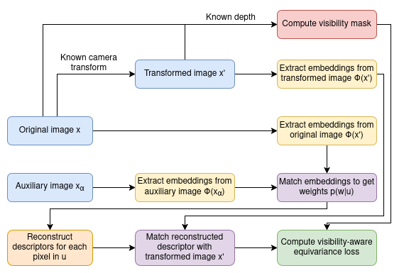
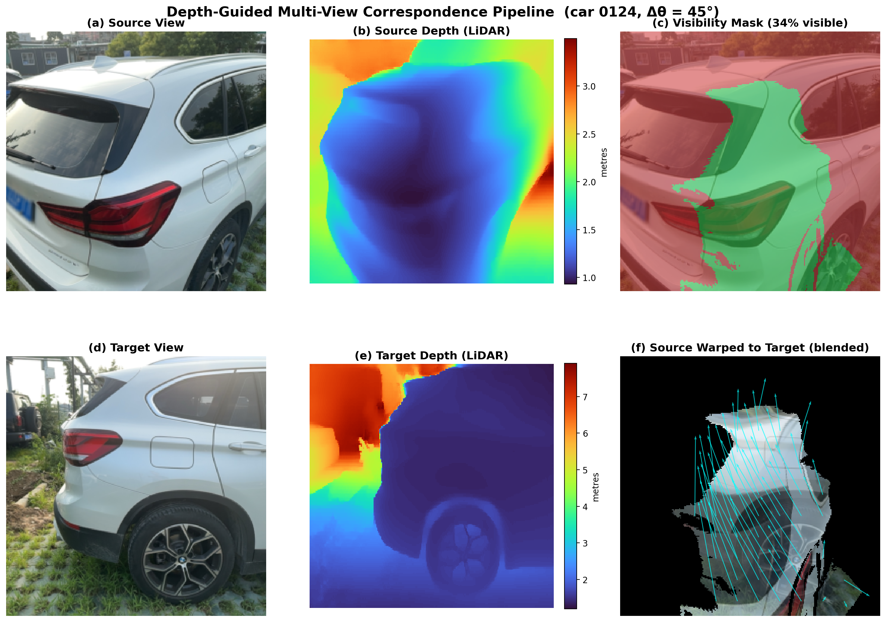
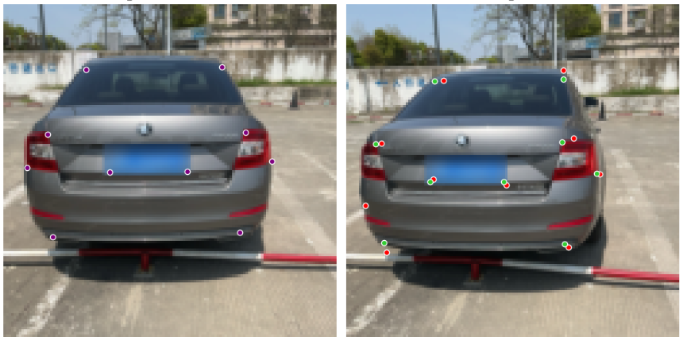
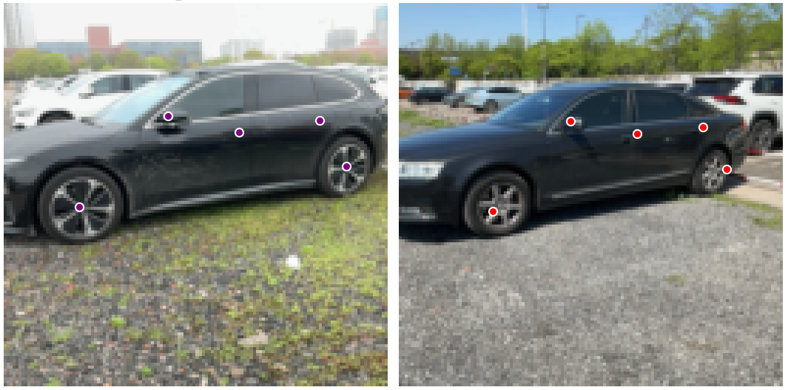
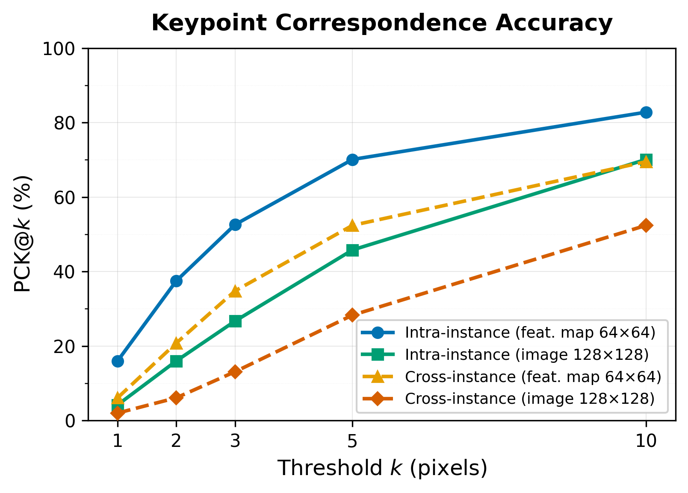
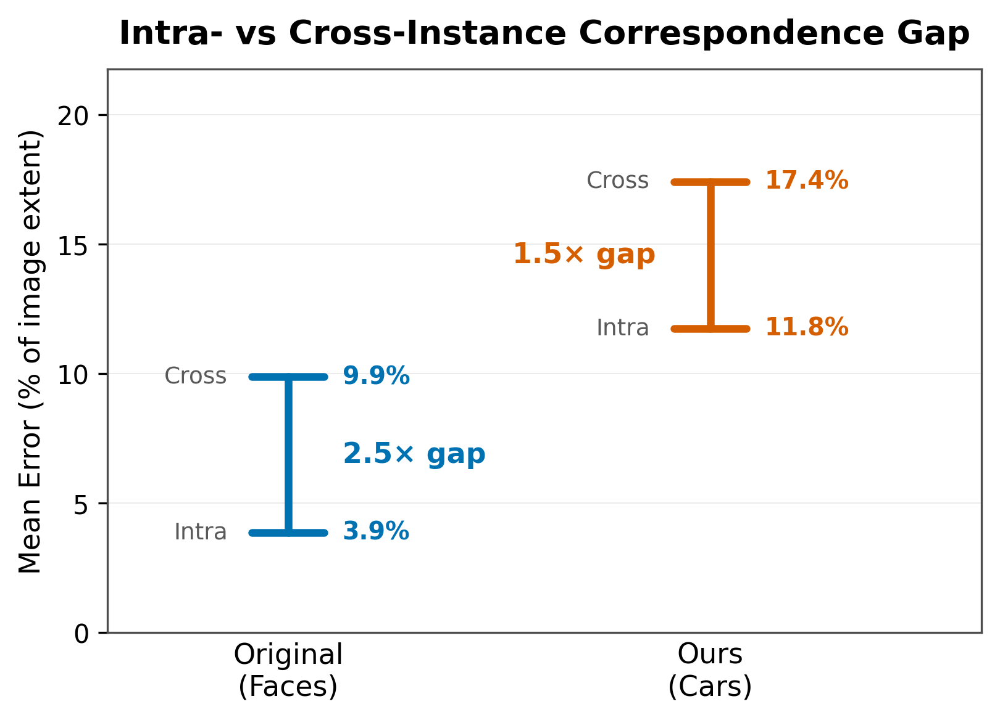

# Extending Unsupervised Landmark Discovery to Multi-Viewpoint Objects | [GitHub](https://github.com/vaibhavparekh9/Unsupervised_Landmark-Discovery_for_Multi-Viewpoint-Objects/) | [Poster](poster_vaibhav_parekh.pdf)

**Association:** Carnegie Mellon University  
**Advisor:** Prof. Kenji Shimada  

---

## Introduction

- Landmark discovery is essential for downstream perception tasks like pose estimation, but manual annotation is expensive.
- Most research revolves around human/animal face/body datasets, limiting applicability to single, near-front-view images.
- ***Thewlis et al., ICCV 2019*** propose learning unsupervised landmarks on faces by DVE (Descriptor Vector Exchange) utilizing synthetic warps.
- Real objects have full 360° viewpoint variation, self-occlusion, and mirror symmetry, which synthetic TPS warps cannot capture.
- We extend DVE to real multi-view car data using LiDAR depth + camera geometry for correspondence and introducing visibility-aware loss normalization to handle occlusion.

We learn dense, view-invariant descriptors without any keypoint annotations, extending unsupervised landmark discovery from 2D faces to multi-viewpoint cars.

---

## Methodology

### DVE Transitive Matching

The DVE mechanism forces descriptors to generalize across car instances by routing matching through an auxiliary image from a different car model.

A stacked Hourglass CNN maps each pixel to a point in 64-D embedding space, where semantically corresponding landmarks produce similar vectors.

### Visibility-Aware Loss

- The standard DVE loss normalizes over all H×W pixels, assuming every pixel to have a valid correspondence.
- But in real multi-view pairs, self-occluded and out-of-bounds pixels have no valid match.
- A visibility-aware loss prevents noise from geometrically invalid correspondences by normalizing only over visible pixels.

---

## Results

### Qualitative Results

Intra-instance Keypoint Correspondence

Cross-instance Keypoint Correspondence

### Quantitative Results

DVE successfully transfers from simpler facial data to real multi-view car data, with **PCK@10 of 82.8% for intra- and 69.5% for cross-instance** correspondence.

The intra- to cross-instance ratio of 1.5× suggests the DVE **mechanism generalizes effectively** across car instances despite the harder domain.

---

## Conclusion

- At inference, the trained descriptors produce view-invariant features without any depth/multi-view input, requiring only a **single RGB image**.
- Future direction: replacing the CNN backbone with a contemporary transformer-based architecture.

---

## Acknowledgement

**Dataset:** [3DRealCar: An In-the-wild RGB-D Car Dataset with 360-degree Views](https://xiaobiaodu.github.io/3drealcar/)